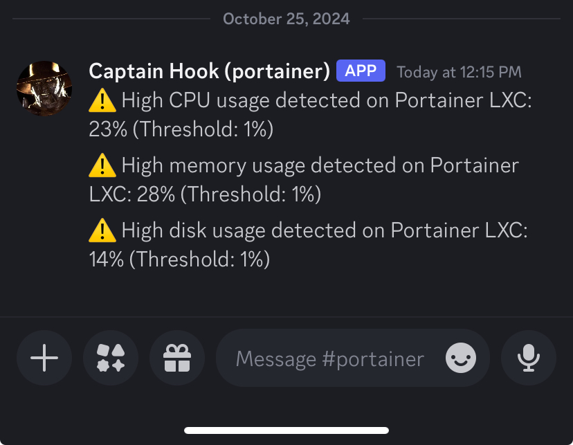

# cpu-mem-disk-chk

This is a basic script that I run on my LXCs and Raspberry Pis for checking the current disk, cpu and memory usage of a device and sending a notification to discord if it passes a specified threshold.

For demonstration purposes, I duplicated the script changed each of the thresholds to 1.

```bash
demo@portainer:/usr/local/bin$ sudo nano syscheck2.sh
demo@portainer:/usr/local/bin$ sudo ./syscheck2.sh
Fri Oct 25 04:15:00 PM UTC 2024: CPU usage: 23%, Memory usage: 28%, Disk usage: 14%
Fri Oct 25 04:15:00 PM UTC 2024: High CPU usage detected on Portainer LXC: 23% (Threshold: 1%)
demo@portainer:/usr/local/bin$ sudo nano syscheck2.sh
demo@portainer:/usr/local/bin$ sudo ./syscheck2.sh
Fri Oct 25 04:15:38 PM UTC 2024: CPU usage: 23%, Memory usage: 28%, Disk usage: 14%
Fri Oct 25 04:15:38 PM UTC 2024: High memory usage detected on Portainer LXC: 28% (Threshold: 1%)
demo@portainer:/usr/local/bin$ sudo nano syscheck2.sh
demo@portainer:/usr/local/bin$ sudo ./syscheck2.sh
Fri Oct 25 04:15:59 PM UTC 2024: CPU usage: 23%, Memory usage: 28%, Disk usage: 14%
Fri Oct 25 04:16:00 PM UTC 2024: High disk usage detected on Portainer LXC: 14% (Threshold: 1%)
```



# Script

You will want to edit `syscheck.sh` to replace the placeholder Discord webhook URL with your actual webhook and edit the device name.

```bash
# Define your Discord webhook URL
DISCORD_WEBHOOK_URL="https://discordapp.com/api/webhooks/YOUR_WEBHOOK_KEY"

# Define the device name
DEVICE_NAME="Your Device Name"
```

The rest of the script should hopefully not need changed, though older hardware may not output its usage stats appropriately. I encountered this with a 2013-era iMac that was running a Debian-based Linux distro and had to adjust how CPU and memory usage is acquired and calculated. However, on my Raspverry Pis (Pi Zero W and Pi5 both running Raspbian OS) and Intel NUC (Proxmox Debian OS with LXCs running Debian 12), it worked fine as is.  

# Cron

Create a cron job as root.

```bash
sudo crontab -e
```

The following expression will depend on where you saved the `syscheck.sh` script on your operating system and where you want the output to be saved whenever the script runs. I keep my script in `/usr/local/bin` and save the log file to `/var/log`. It runs every 5 minutes.

```bash
*/5 * * * * /usr/local/bin/syscheck.sh >> /var/log/syscheck.log 2>&1
```

# Cycling Logs

Create a `logrotate` expression to cycle out the files created in `/var/log`.

```bash
sudo nano /etc/logrotate.d/syscheck
```

```bash
/var/log/syscheck.log {
    weekly
    rotate 4
    missingok
    notifempty
    compress
    delaycompress
    copytruncate
    create 644 root root
}
```

This will rotate logs weekly and keep them for 4 weeks.
